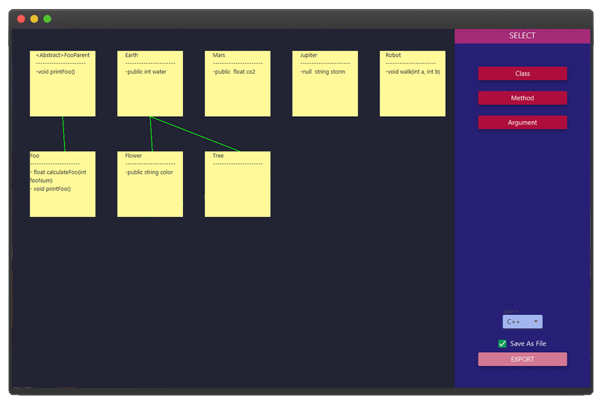

# Code Generator And UML Diagram


[](https://www.python.org/)
[](LICENSE)
[](https://github.com/amir-shamsi)
<a href="https://github.com/Amir-Shamsi/code-generator-and-uml-diagram" title="Repo Size">

</a>

<p align="left">
  <a href="https://openjfx.io/">
    
  </a>
  <a href="http://www.jfoenix.com/">
    
  </a>
  <a href="https://www.java.com/">
    
  </a>
</p>


This application allows drawing of UML diagrams in graphic user interface and generating the code in Java or Cpp. It supports:
   - Classes
   - Methods
   - Arguments

### Draw UML Graph
It's easy to draw a uml graph based on what you need only by dragging `class` or `method` or `Arg` into the board. 
<p align="center">
  
</p>

### Code Generating

Here is the output code of the example graph in Java
```java
abstract class FooParent
{
    abstract void printFoo();
}

class Earth
{
    public int water;
}

class Mars
{
    public float co2;
}

class Jupiter
{
    public String water;
}

class Robot
{
    void walk(int a, int b)
    {
    }
}

public class Foo extends FooParent
{
    public int water;
    public static float calculateFoo(int fooNum)
    {
    }
    public void printFoo()
    {
    }
}

class flower extends Earth
{
    public String color;
}

class Tree extends Earth
{
}


```

### Installation
1. Clone the repo
  ```sh
  git clone https://github.com/Amir-Shamsi/code-generator-and-uml-diagram.git
  ```
2. Install the dependencies from `pom.xml`
3. Enjoy!
